<p align="center">
  
</p>

<p align="center">
  <a href="https://www.linkedin.com/in/victhorstos/"></a>
  <a href="https://twitter.com/otakev"></a>
  <a href="https://instagram.com/victhorstos"></a>
  <a href="mailto:victhorstos@gmail.com"></a>
</p>

<br/>

```typescript
const victhor = {
  aka: "Otakev",
  location: "São Paulo, Brasil 🇧🇷",
  dayJob: "Dev Delphi @ Alterdata",
  loves: ["criar coisas do zero", "automação", "ferramentas de desktop"],
  code: ["Delphi", "Python", "JavaScript", "SQL"],
  currentlyLearning: ["Python", "IA no fluxo de dev"],
  mood: "codando · tomando café · repetindo ☕",
};
```

<p align="center">
  
</p>

<h3 align="center">🚧 no que eu tô mexendo agora</h3>

<table align="center">
  <tr>
    <td width="50%" valign="top" align="center">
      <h4>🖥️ Ultrawide Screen Sharing Tool</h4>
      
      <br/><br/>
      <sub>
        ferramenta pra compartilhar só uma parte da tela ultrawide,
        em vez de jogar o monitor inteiro na call. protótipo saindo do forno,
        construído junto com o Kiro. 🤖
      </sub>
    </td>
    <td width="50%" valign="top" align="center">
      <h4>🤝 Assistente de Desktop</h4>
      
      <br/><br/>
      <sub>
        um assistente pessoal que integra com mouse e páginas web
        pra automatizar tarefas repetitivas do dia a dia.
        projeto pessoal, feito no meu tempo (e no meu PC). 🏠
      </sub>
    </td>
  </tr>
</table>

<p align="center">
  <sub>💼 no trampo: dev Delphi na Alterdata, mexendo com conversão de dados de sistemas legados.</sub>
</p>

<p align="center">
  
</p>

<h3 align="center">🕹️ minhas ferramentas</h3>

<p align="center">
  
</p>

<p align="center">
  
</p>

<h3 align="center">📊 meus números</h3>

<p align="center">
  
  
</p>

<p align="center">
  
</p>

<p align="center">
  
</p>

<h3 align="center">👾 pac-man comendo meus commits</h3>

<p align="center">
  <picture>
    <source media="(prefers-color-scheme: dark)" srcset="https://raw.githubusercontent.com/ArchVeketo/ArchVeketo/output/pacman-contribution-graph-dark.svg"/>
    <source media="(prefers-color-scheme: light)" srcset="https://raw.githubusercontent.com/ArchVeketo/ArchVeketo/output/pacman-contribution-graph.svg"/>
    
  </picture>
</p>

<p align="center">
  
</p>

<p align="center">
  
</p>

<p align="center">
  <sub>⚡ <i>obrigado por passar por aqui — bora codar algo legal</i> ⚡</sub>
</p>


